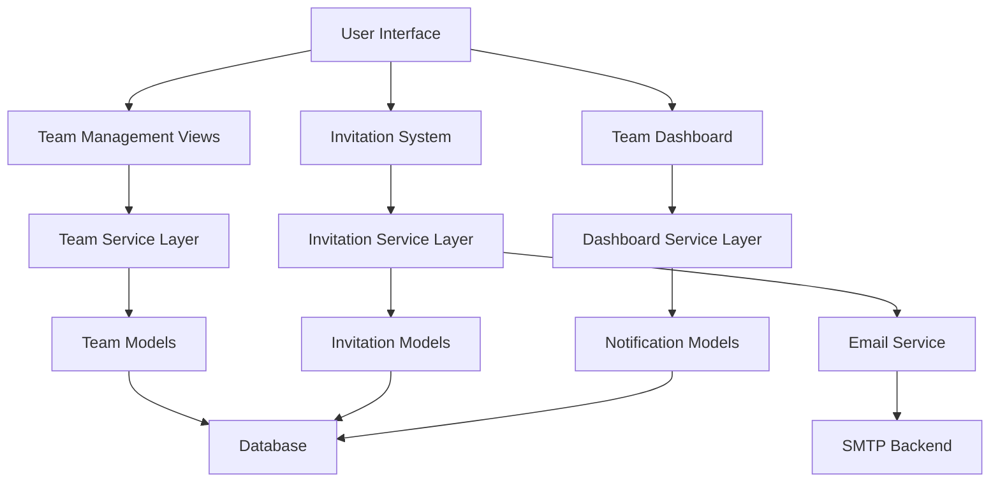
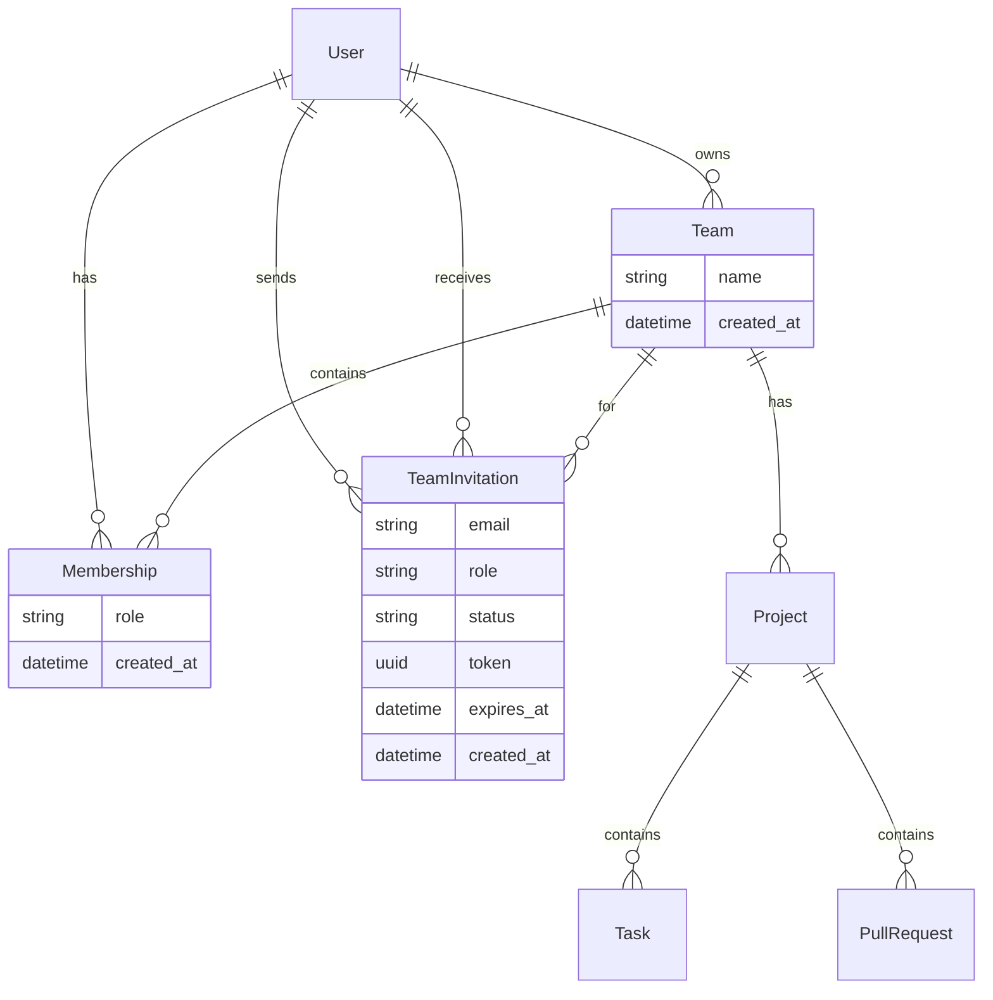

# Team Management and User Invitations - Design Document

## Overview

This design extends the existing AI-Powered Developer Workflow Hub with comprehensive team management capabilities. The system will enable users to create teams, invite members via email, manage role-based permissions, and provide collaborative dashboards for team workflows.

The design leverages the existing Django architecture with User, Team, and Membership models, extending them with invitation management, notification systems, and enhanced permission controls.

## Architecture

### High-Level Architecture



### Service Layer Design

The design follows a service-oriented approach with clear separation of concerns:

- **Team Management Service**: Handles team creation, member management, and role assignments
- **Invitation Service**: Manages invitation lifecycle, email notifications, and acceptance/decline workflows
- **Permission Service**: Centralized role-based access control validation
- **Notification Service**: Handles in-app notifications and email delivery

## Components and Interfaces

### 1. Enhanced Models

#### TeamInvitation Model
```python
class TeamInvitation(models.Model):
    STATUS_CHOICES = [
        ('pending', 'Pending'),
        ('accepted', 'Accepted'),
        ('declined', 'Declined'),
        ('expired', 'Expired'),
    ]
    
    team = models.ForeignKey(Team, on_delete=models.CASCADE)
    invited_by = models.ForeignKey(User, on_delete=models.CASCADE, related_name='sent_invitations')
    invited_user = models.ForeignKey(User, on_delete=models.CASCADE, null=True, blank=True)
    email = models.EmailField()  # For non-registered users
    role = models.CharField(max_length=20, choices=Membership.ROLE_CHOICES, default='Developer')
    status = models.CharField(max_length=20, choices=STATUS_CHOICES, default='pending')
    token = models.UUIDField(default=uuid.uuid4, unique=True)
    expires_at = models.DateTimeField()
    created_at = models.DateTimeField(auto_now_add=True)
```

**Design Rationale**: The invitation model supports both registered and unregistered users through the optional `invited_user` field and required `email` field. The UUID token provides secure invitation links, and expiration ensures security.

#### Enhanced Notification Model
The existing Notification model will be extended to support team invitation workflows:

```python
# Additional notification types for team management
NOTIFICATION_TYPES = [
    ('team_invitation', 'Team Invitation'),
    ('invitation_accepted', 'Invitation Accepted'),
    ('invitation_declined', 'Invitation Declined'),
    ('team_member_added', 'Team Member Added'),
    ('team_role_changed', 'Team Role Changed'),
]
```

### 2. Service Layer Components

#### TeamService
```python
class TeamService:
    @staticmethod
    def create_team(owner, name):
        """Create team with owner as admin"""
        
    @staticmethod
    def invite_member(team, inviter, email, role='Developer'):
        """Send team invitation"""
        
    @staticmethod
    def get_user_teams(user):
        """Get all teams user belongs to"""
        
    @staticmethod
    def can_invite_members(user, team):
        """Check if user can invite members to team"""
```

#### InvitationService
```python
class InvitationService:
    @staticmethod
    def send_invitation(invitation):
        """Send invitation email and create notification"""
        
    @staticmethod
    def accept_invitation(invitation, user):
        """Accept invitation and create membership"""
        
    @staticmethod
    def decline_invitation(invitation):
        """Decline invitation and update status"""
        
    @staticmethod
    def get_pending_invitations(user):
        """Get user's pending invitations"""
```

### 3. View Layer Components

#### Team Management Views
- `TeamListView`: Display user's teams with member counts and roles
- `TeamCreateView`: Create new team (extends existing functionality)
- `TeamDetailView`: Team dashboard with members, projects, and activities
- `TeamInviteView`: Send invitations to new members
- `TeamMemberManageView`: Manage existing team members and roles

#### Invitation Management Views
- `InvitationListView`: Display pending invitations for user
- `InvitationAcceptView`: Accept invitation via token link
- `InvitationDeclineView`: Decline invitation via token link

### 4. Permission System

#### Role-Based Access Control
```python
class TeamPermissions:
    ROLE_PERMISSIONS = {
        'Admin': ['invite_members', 'manage_members', 'manage_projects', 'view_team'],
        'Developer': ['view_team', 'view_projects', 'create_tasks'],
        'Viewer': ['view_team', 'view_projects'],
    }
    
    @staticmethod
    def has_permission(user, team, permission):
        """Check if user has specific permission in team"""
```

**Design Rationale**: The permission system uses a simple role-based approach that can be easily extended. Admin users have full control, Developers can contribute to projects, and Viewers have read-only access.

## Data Models

### Entity Relationship Diagram



### Data Flow for Key Operations

#### Team Invitation Flow
1. Admin user initiates invitation with email and role
2. System creates TeamInvitation record with unique token
3. Email sent to invited user with acceptance link
4. Notification created for invited user (if registered)
5. User clicks link, system validates token and expiration
6. Upon acceptance, Membership record created and invitation marked accepted

#### Team Dashboard Data Aggregation
1. Fetch team members with roles
2. Aggregate team projects with recent activity
3. Collect recent pull requests from team projects
4. Gather team notifications and activities
5. Apply role-based filtering for displayed content

## Error Handling

### Invitation Error Scenarios
- **Duplicate Invitations**: Check for existing pending invitations before creating new ones
- **Invalid Email**: Validate email format and handle bounced emails
- **Expired Invitations**: Automatically mark expired invitations and prevent acceptance
- **Permission Errors**: Validate inviter permissions before sending invitations
- **Non-existent Users**: Handle invitations to unregistered users gracefully

### Team Access Control Errors
- **Unauthorized Access**: Redirect to login or show permission denied message
- **Invalid Team Operations**: Validate user permissions before allowing team modifications
- **Concurrent Modifications**: Handle race conditions in membership changes

### Error Response Strategy
```python
class TeamManagementError(Exception):
    """Base exception for team management operations"""
    
class InvitationError(TeamManagementError):
    """Invitation-specific errors"""
    
class PermissionError(TeamManagementError):
    """Permission-related errors"""
```

## Testing Strategy

### Unit Testing
- **Model Tests**: Validate model constraints, relationships, and business logic
- **Service Tests**: Test service layer methods with various input scenarios
- **Permission Tests**: Verify role-based access control logic
- **Invitation Tests**: Test invitation lifecycle and edge cases

### Integration Testing
- **Email Integration**: Test email sending with mock SMTP backend
- **Database Transactions**: Verify data consistency across related models
- **Authentication Flow**: Test invitation acceptance with user registration
- **API Endpoints**: Test REST API responses and error handling

### End-to-End Testing
- **Team Creation Workflow**: Complete flow from team creation to member invitation
- **Invitation Acceptance**: Full invitation email to membership creation flow
- **Dashboard Functionality**: Test team dashboard with various user roles
- **Permission Enforcement**: Verify access control across different views

### Test Data Strategy
```python
class TeamTestCase(TestCase):
    def setUp(self):
        self.owner = User.objects.create_user('owner', 'owner@test.com')
        self.member = User.objects.create_user('member', 'member@test.com')
        self.team = Team.objects.create(name='Test Team', owner=self.owner)
        self.membership = Membership.objects.create(
            user=self.owner, team=self.team, role='Admin'
        )
```

### Performance Testing
- **Dashboard Load Times**: Ensure team dashboard loads efficiently with large datasets
- **Invitation Bulk Operations**: Test performance with multiple simultaneous invitations
- **Permission Checks**: Verify permission validation doesn't create bottlenecks
- **Database Query Optimization**: Monitor N+1 queries in team-related views

## Security Considerations

### Invitation Security
- **Token-based Authentication**: Use UUID tokens for invitation links to prevent guessing
- **Expiration Enforcement**: Automatically expire invitations after configurable period
- **Rate Limiting**: Prevent spam invitations from single users
- **Email Validation**: Validate email addresses before sending invitations

### Access Control Security
- **Permission Validation**: Always validate user permissions server-side
- **Team Isolation**: Ensure users can only access teams they belong to
- **Role Escalation Prevention**: Prevent users from granting themselves higher roles
- **Audit Logging**: Log team membership changes for security monitoring

### Data Protection
- **Email Privacy**: Don't expose email addresses to unauthorized users
- **Team Information**: Restrict team details to members only
- **Invitation Tokens**: Ensure tokens are cryptographically secure and single-use

## Implementation Notes

### Email Configuration
The system uses Django's email backend (currently console backend for development). For production:
```python
EMAIL_BACKEND = 'django.core.mail.backends.smtp.EmailBackend'
EMAIL_HOST = 'smtp.gmail.com'
EMAIL_PORT = 587
EMAIL_USE_TLS = True
EMAIL_HOST_USER = 'your-email@gmail.com'
EMAIL_HOST_PASSWORD = 'your-password'
```

### Notification Integration
Leverage the existing Notification model and viewset, extending the payload structure for team-specific notifications:
```python
{
    'type': 'team_invitation',
    'team_id': 123,
    'team_name': 'Development Team',
    'invited_by': 'john_doe',
    'role': 'Developer',
    'invitation_token': 'uuid-token'
}
```

### Frontend Integration
The design maintains consistency with existing Bootstrap-based templates, adding:
- Team management dashboard
- Invitation management interface
- Role-based UI element visibility
- Real-time notification updates

### Migration Strategy
Database migrations will:
1. Create TeamInvitation model
2. Add indexes for performance optimization
3. Create default teams for existing users
4. Migrate existing team relationships

This design provides a robust foundation for team collaboration while maintaining the existing system's architecture and user experience patterns.